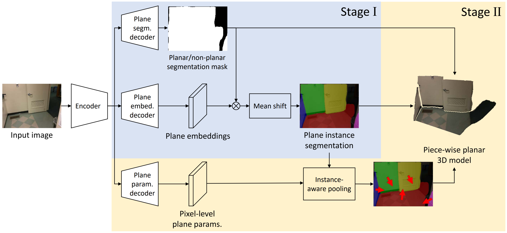

# PlanarReconstruction

PyTorch implementation of our CVPR 2019 paper:

[Single-Image Piece-wise Planar 3D Reconstruction via Associative Embedding
](https://arxiv.org/pdf/1902.09777.pdf)

Zehao Yu\*, [Jia Zheng](https://bertjiazheng.github.io/)\*, [Dongze Lian](https://svip-lab.github.io/team/liandz.html), [Zihan Zhou](https://faculty.ist.psu.edu/zzhou/Home.html), [Shenghua Gao](http://sist.shanghaitech.edu.cn/sist_en/2018/0820/c3846a31775/page.htm)

(\* Equal Contribution)



## Prepare data
Please download the .tfrecords files for training and testing converted by [Chen Liu](http://art-programmer.github.io/index.html) from [here](https://github.com/art-programmer/PlaneNet). Then conver the .tfrecords to .npz file as the following:

```bash
python data_tools/convert_tfrecords.py --data_type=train --input_tfrecords_file=*train.tfrecords --output_dir=/path/to/save/processd/data
python data_tools/convert_tfrecords.py --data_type=val --input_tfrecords_file=*val.tfrecords --output_dir=/path/to/save/processd/data
```

## Train
Run the following to train our network. 
```bash
python main.py train with dataset.root_dir=/path/to/save/processd/data
```

## Evaluatioin
Please download our trained network from [here](https://drive.google.com/file/d/1Aa1Jb0CGpiYXKHeTwpXAwcwu_yEqdkte/view?usp=sharing).

To evaluate the performance of our methods, please run:
```bash
python main.py eval with dataset.root_dir=/path/to/save/processd/data resume_dir=pretrained.pt dataset.batch_size=1

```

## Acknowledgements
We thank [Chen Liu](http://art-programmer.github.io/index.html) for his great works and repos.

## Citation
Please cite our paper for any purpose of usage.
```
@inproceedings{Yu2019Single,
  title={Single-Image Piece-wise Planar 3D Reconstruction via Associative Embedding},
  author={Zehao Yu and Jia Zheng and Dongze Lian and Zihan Zhou and Shenghua Gao},
  booktitle={Proceedings of the IEEE Conference on Computer Vision and Pattern Recognition},
  year={2019}
}
```
